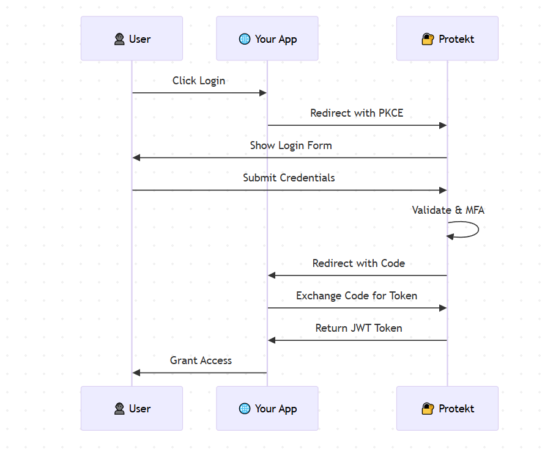

# What is Protekt?

Protekt is a cloud authentication platform that helps developers add secure login to their applications. Instead of building authentication from scratch, you can use Protekt's APIs and pre-built components to get login working in minutes.

## Why Use Protekt?

Building authentication from scratch is complex and risky. Developers often underestimate the security challenges involved in properly managing user identities and access controls. Common pitfalls include weak password policies, inadequate session management, vulnerable password reset flows, and poor multi-factor authentication implementation.

A single security vulnerability can expose user data, damage your reputation, and result in costly compliance violations. Proper identity and access management isn't just about login forms - it's about protecting your users and your business from increasingly sophisticated threats. Here's why you should use Protekt as the identity and access management solution for your applications:

- **Save development time**: Get authentication working in under 30 minutes instead of weeks of custom development.

- **Built-in security**: OAuth 2.0, multi-factor authentication, and enterprise-grade security features included by default.

- **Easy to integrate**: Simple APIs, SDKs for popular frameworks, and pre-built UI components.

## How Protekt works

The following diagram illustrates the secure authentication flow that protects your users while keeping integration simple:

Here's what happens when a user logs in:

1. **User clicks login** in your app
2. **Redirect to Protekt** for secure authentication  
3. **User enters credentials** and completes any required verification
4. **Protekt generates tokens** and redirects back to your app
5. **Your app validates tokens** and grants access

## What You Can Build

Protekt works with any type of application you're building:

- **Web Applications**: Add login and registration to websites and web apps using JavaScript, React, Vue, or any framework.
- **Mobile Apps**: Secure iOS and Android apps with native SDKs and OAuth flows.
- **APIs**: Protect your API endpoints by validating JWT tokens from Protekt.
- **Enterprise Apps**: Support SAML SSO, team management, and organization hierarchies.

## Key Features

Protekt provides everything you need to implement secure authentication:

**Authentication Methods**:
- Email and password
- Social login (Google, GitHub, Microsoft)
- Magic links (passwordless)
- Multi-factor authentication

**Developer Tools**:
- REST APIs with comprehensive docs
- SDKs for JavaScript, React, Python, iOS, Android
- Test environment for safe development
- Real-time webhooks

**Security & Compliance**:
- OAuth 2.0 and OpenID Connect
- SOC 2 and GDPR compliant
- Advanced threat detection
- 99.9% uptime SLA

## Common Use Cases

Here are some popular ways developers use Protekt to secure their applications:

- **SaaS Applications**: User registration, login, and account management
- **E-commerce Sites**: Customer authentication and profile management  
- **Mobile Apps**: Secure user authentication across platforms
- **Internal Tools**: Employee login with SSO and role-based access
- **APIs**: Token-based authentication for microservices

## Get Help

- **Documentation**: Browse our guides and API references
- **Community**: Join discussions at [community.protekt.dev](https://community.protekt.dev)
- **Support**: Contact us at [developers@protekt.dev](mailto:developers@protekt.dev)
